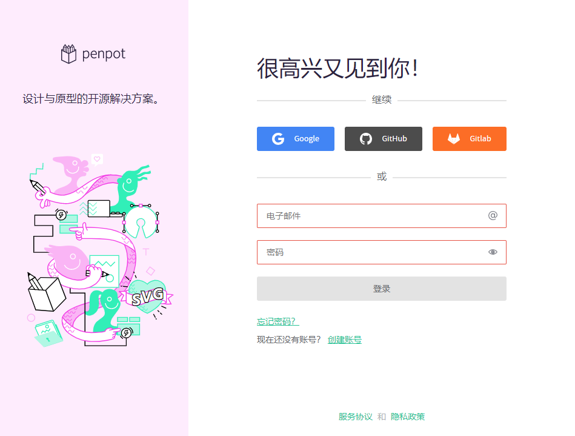
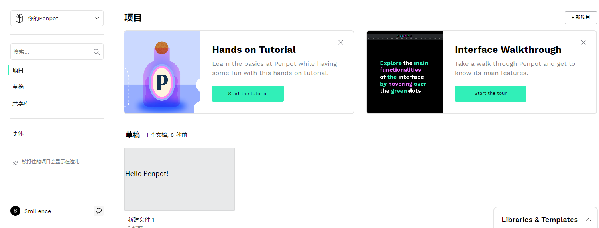
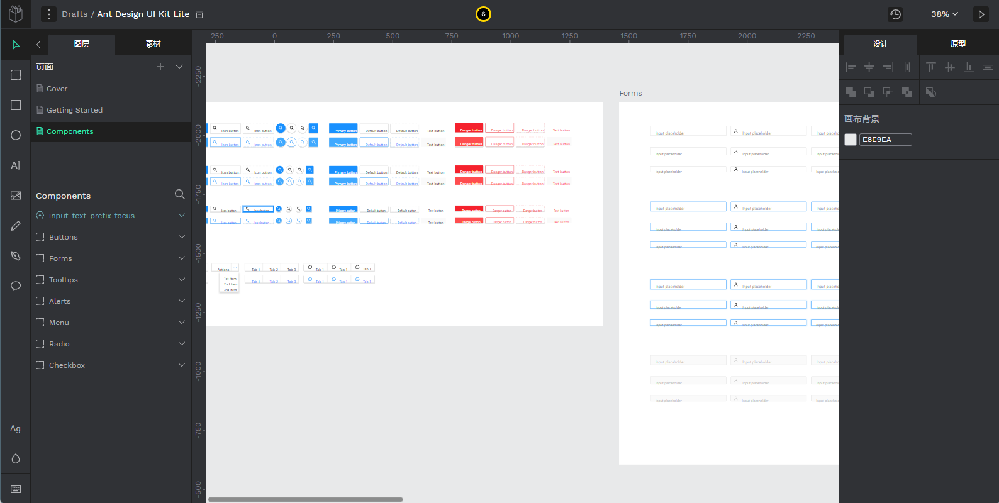
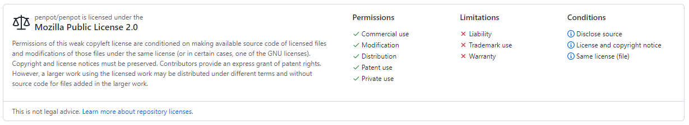

Penpot是一款很棒的原型设计软件，[官网](https://penpot.app/)称之为“设计与原型的开源解决方案”。它开源免费、跨平台、团队协作等优势于一体，这还不算，更重要的的是：没有使用限制！

常见的团队协作工具不是收费就是限制用量，要么团队人数限制，要么文件（项目）数量限制，在Penpot中都是不存在的，任意创建团队，任意邀请成员，任意创建项目，随你。这正式我推荐它的重要原因。

没有限制还体现在私有化部署方面，市面上的Saas服务私有化部署动辄几十万甚至更高，但Penpot不仅没有限制，而且部署方式和相关文档也十分详细，一键部署。

下面分别从几个方面介绍一下：

## 功能体验

官网的说法是：Penpot makes design and prototyping accessible to every team in the world

基于B/S的架构，任何现代浏览器可以打开即用，所有你需要的只是接入Internet。当然，你的成功也是可以通过一个链接完成共享，让其他人员轻松访问你的成果。

现代化个性化的UI，人性化的布局，友好的快捷键，使用起来也十分顺手。

首次使用没有素材？模板库来帮你，你可以导入其他优质模板，快速启动开发。

## 技术方案
1. 架构
   
开发语言使用的是Clojure，可以编译为JVM字节码文件运行在JVM虚拟机上。
2. 页面渲染SVG
SVG方案可以和大部分矢量图工具兼容，并且Web十分友好。

3. 导出方案
导出使用的是当前十分成熟的Headless Chrome的方案，不会存在兼容性等问题。

## 使用及限制情况
懒得部署可以直接使用官方提供的云服务[Penpo cloud app](https://design.penpot.app/)，服务估计部署在国外，但对使用速度没有太大影响。

如果想要更好的体验，私有话部署也十分方便，基于Docker的部署方式几乎可以一键完成。这就是[我自己部署的](http://123.60.168.5/)

还想个性化定制？这些早就帮你想好了，什么是否开放注册、邮件验证、域名等等各项配置，就是一个开关的事儿。

项目使用的开源协议是：“MPL-2.0 license”，使用限制如下：

## 开源社区的活跃情况
项目的开源社区十分活跃: Contributors 102  Fork 883  Starred 19.4k

Penpot的主要贡献者是[Kaleidos](https://kaleidos.net/products)，出名的产品还有[TAIGA](https://taiga.io/)，也是一款十分强大的团队协作于项目管理软件。

国际化支持，简体中文已经全部翻译完成。

## 其他
项目目前还处在Beta版本，但功能和体验已经能够满足日常使用。
